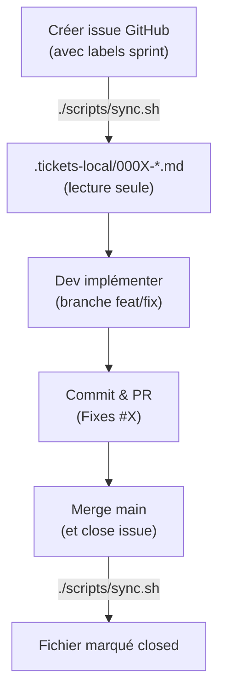

# 📋 Workflow Tickets & Development

## Quick Start

### Consulter les tickets localement

```bash
# Synchroniser depuis GitHub
./scripts/sync.sh

# Consulter l'index
cat .tickets-local/INDEX.md

# Lire un ticket spécifique
cat .tickets-local/0001-Feature_request.md
```

### Créer/éditer un ticket

1. **Créer un ticket sur GitHub** → https://github.com/Jfrequelin/VocalAssist/issues
2. **Synchroniser localement** → `./scripts/sync.sh`
3. **Consulter et répondre** → fichier markdown `.tickets-local/`
4. **Implémenter le fix** → branche feature
5. **Créer une PR** → référence le ticket (ex: "Fixes #42")

## 🔄 Workflow complet



## 📌 Commandes utiles

### Synchroniser quotidiennement

```bash
# Tous les tickets ouverts du sprint actif
./scripts/sync.sh open --label "Sprint 2 weeks"

# Ou tous les ouverts
./scripts/sync.sh
```

### Filtrer et lister

```bash
# Voir les 5 derniers tickets modifiés
ls -lt .tickets-local/*.md | head -5

# Chercher des tickets par mot-clé
grep -r "STT\|TTS" .tickets-local/

# Compter les tickets par label
grep "^## Labels" .tickets-local/*.md | wc -l
```

### Intégrer en CI/CD

Voir [scripts/README.md](scripts/README.md#-ci--cd) pour configurer une sync automatique.

## 🏷️ Labels recommandés

Utiliser ces labels pour catégoriser les tickets:

| Label | Couleur | Usage |
|-------|---------|-------|
| `EDGE` | Bleu | Firmware ESP32-S3 |
| `SRV` | Vert | Serveur central (STT/TTS/Leon) |
| `ORCH` | Orange | Orchestrateur local-first |
| `DOM` | Purple | Domotique/Home Assistant |
| `OBS` | Rouge | Observabilité/logging/tracing |
| `Priority-1` | Rouge vif | Critique (blocker) |
| `Priority-2` | Jaune | Important (du sprint) |
| `Priority-3` | Gris | Nice-to-have |
| `Sprint 2 weeks` | Vert clair | Sprint actuelt |

## 📊 KPI by ticket type

### Mesurer la progression

```bash
# Nombre total de tickets ouverts
./scripts/sync.sh open | grep "✨\|♻️" | wc -l

# Tickets fermés depuis dernier sync
git log --oneline | grep "Fixes #" | wc -l

# Historique des fichiers .tickets-local
ls -la .tickets-local/manifest.json
```

## ⚠️ Points importants

**✅ À faire:**
- Créer les tickets sur GitHub avec labels appropriés
- Synchroniser avant de commencer le dev
- Référencer le ticket dans les commits (`Fixes #42`)
- Fermer la issue quand le PR est mergé

**❌ À ne pas faire:**
- Éditer les fichiers `.md` localement (ils seront regénérés)
- Commiter des fichiers de `.tickets-local/`
- Modifier les tickets depuis `.md` local (éditer sur GitHub)

## 🔗 Ressources

- [Scripts de synchronisation](scripts/README.md)
- [Architecture générale](docs/02-architecture/)
- [Sprint plan](docs/03-delivery/sprint-2-weeks.md)
- [Roadmap (6 mois)](docs/03-delivery/roadmap.md)

---

**Last updated**: 2026-04-30  
**Author**: VocalAssist Team
